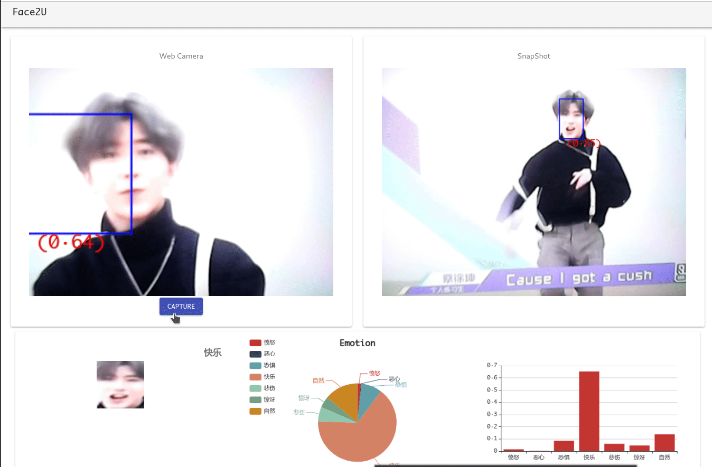

# 人脸识别 表情分类
使用webcam识别人脸和情绪分类

### 模型训练
使用keras训练，三层卷积一层全连接，训练过程见kaggle-emotion.html，数据来自kaggle比赛数据集`fer2013`

### 前端
 - react
 - material-ui
 - face-api.js
人脸动态检测使用了face-api.js的库，canvas截取100×100的人脸图片，转化成RGBA数据交由后台处理，返回分类数据

### 后端
 - keras
 - flask

后端完成表情分类的工作，拿到RGBA数组转化成RGB矩阵，压缩，灰化交给模型分类。

### 关于构建与部署
`ui`中是react项目，构建后可独立运行，需要先配置`/ui/src/CameraSection.js`中的flask服务器地址，之后就可构建。
```
cd ui
yarn install
yarn build
```
把build文件夹拷贝到web服务器目录中，（由于最新的chrome已经禁止了不安全的连接开启userMedia，必须要用https或者在localhost下，否则webcam无法使用，而firefox似乎还可以）

之后配置`server/server.py`中的flask服务器地址和端口号，需要和上述前端配置一致。要保证已经安装了`keras`,`PIL`,`tensorflow`,`flask`
```
cd server
python server.py
```
此时打开浏览器，输入地址即可

### 效果

